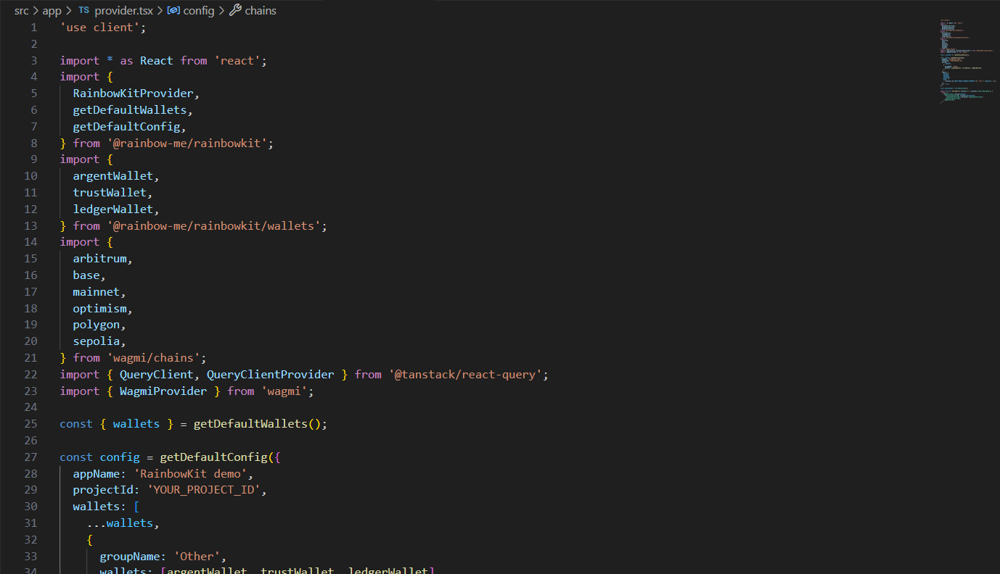
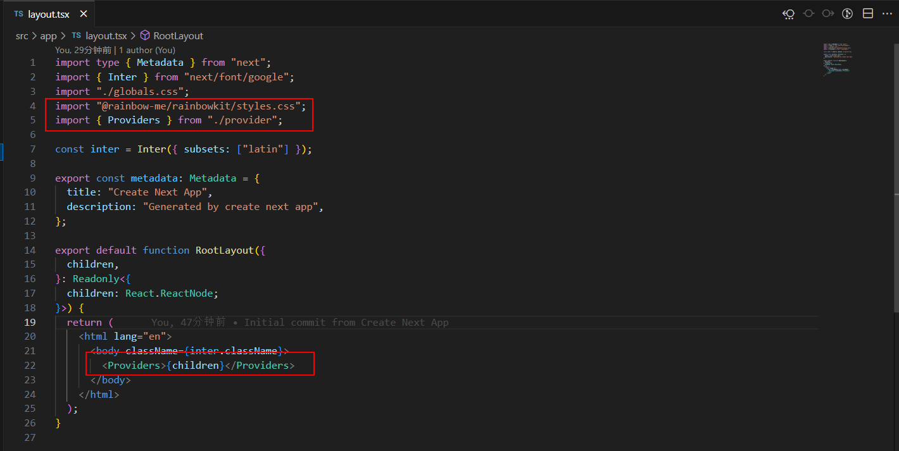
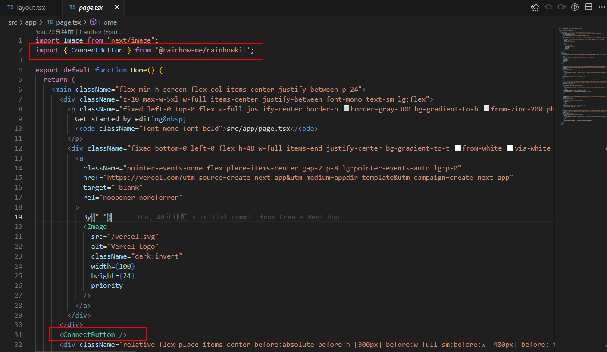
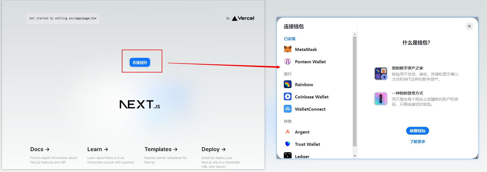

# 在next项目中引入rainbowkit，链接钱包的demo
1. 安装RainbowKit及其对等依赖项， wagmi 和 viem.

   `npm install @rainbow-me/rainbowkit wagmi viem@2.x @tanstack/react-query`
   
2. 创建provider.tsx文件，并在其中完成相关代码配置

   
   
3. 引入provider组件，并用其包裹要使用链接钱包功能的页面

   

4. 导入ConnectButton，并使用

   

   
